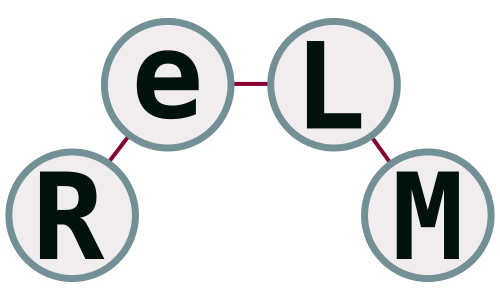

# ReLM
<p align="center">
  
</p>

A repository building on work from "[Validating Large Language Models with ReLM](https://arxiv.org/abs/2211.15458)" (MLSys '23).
ReLM is a <ins>R</ins>egular <ins>E</ins>xpression
engine for <ins>L</ins>anguage <ins>M</ins>odels.
The goal of ReLM is to make it easier for users to
test aspects of a language model, such as memorization, bias, toxicity finding,
and language understanding.
For example, to find the most likely (i.e., potentially memorized)
phone numbers in the largest GPT2 model under top-k=40
decoding, you can run the following code snippet:

```python3
import relm
import torch
from transformers import AutoModelForCausalLM, AutoTokenizer
model_id = "gpt2-xl"
device = "cuda" if torch.cuda.is_available() else "cpu"
tokenizer = AutoTokenizer.from_pretrained(model_id, use_fast=True)
model = AutoModelForCausalLM.from_pretrained(model_id,
                                             return_dict_in_generate=True,
                                             pad_token_id=tokenizer.eos_token_id)
model = model.to(device)
query_string = relm.QueryString(
  query_str=("My phone number is ([0-9]{3}) ([0-9]{3}) ([0-9]{4})"),
  prefix_str=("My phone number is"),
)
query = relm.SimpleSearchQuery(
  query_string=query_string,
  search_strategy=relm.QuerySearchStrategy.SHORTEST_PATH,
  tokenization_strategy=relm.QueryTokenizationStrategy.ALL_TOKENS,
  top_k_sampling=40,
  num_samples=10,
)
ret = relm.search(model, tokenizer, query)
for x in ret:
  print(tokenizer.decode(x))
```

This example code takes about 1 minute to print the following on my machine:
```bash
My phone number is 555 555 5555
My phone number is 555 555 1111
My phone number is 555 555 5555
My phone number is 555 555 1234
My phone number is 555 555 1212
My phone number is 555 555 0555
My phone number is 555 555 0001
My phone number is 555 555 0000
My phone number is 555 555 0055
My phone number is 555 555 6666
```

As can be seen, the top number is `555 555 5555`, which is a widely used
fake phone number.

## Syntax
By default, the regex backend is using Rust's regex utilities.
The syntax is described [here](https://docs.rs/regex/latest/regex/).

## Installation
We recommend using
[Miniconda](https://docs.conda.io/en/latest/miniconda.html) to create a standardized environment.
We use a Python3.7 environment (py37) for both building and installing the
following software.

To install:
```bash
wget https://repo.anaconda.com/miniconda/Miniconda3-latest-Linux-x86_64.sh
bash Miniconda3-latest-Linux-x86_64.sh
```
You will have to scroll though and type "yes" at the end. You should leave the
options as the defaults.


After install, you will want to create the environment. To create it:

```bash
conda create -n py37 python=3.7
```

To activate the environment:
```bash
conda activate py37
```

You can then install dependencies inside this environment.
We additionally use Rust as a backend for parts of the ReLM runtime.
Therefore, you will need to install a Rust compiler and build the corresponding
extensions (described below).

###### PyTorch
Install PyTorch as instructed [here](https://pytorch.org/get-started/locally/).

###### Rust
You will need to install Rust and Cargo, as explained [here](https://doc.rust-lang.org/cargo/getting-started/installation.html).
The easiest way is to run:
```bash
curl https://sh.rustup.rs -sSf | sh
```

You should also have a C linker installed:
```bash
apt install build-essential
```

###### ReLM Install
Build and install ReLM.
```bash
pushd relm
bash install.sh
popd
```

## Getting Started
We recommend checking out the Jupyter Notebook
[Introduction_to_ReLM](notebook/Introduction_to_ReLM.ipynb) to get started.

To run it, you will need to install additional dependencies in the conda
environment.
```bash
conda install nb_conda
conda install -c conda-forge ipywidgets
pip install matplotlib
```

Then you can do:
```bash
cd notebook
jupyter-notebook Introduction_to_ReLM.ipynb
```

## Experiments
Experiments in the paper can be found under the [Experiments](experiments)
directory.
Instructions for installation and running are in the corresponding
[README.md](experiments/README.md).
